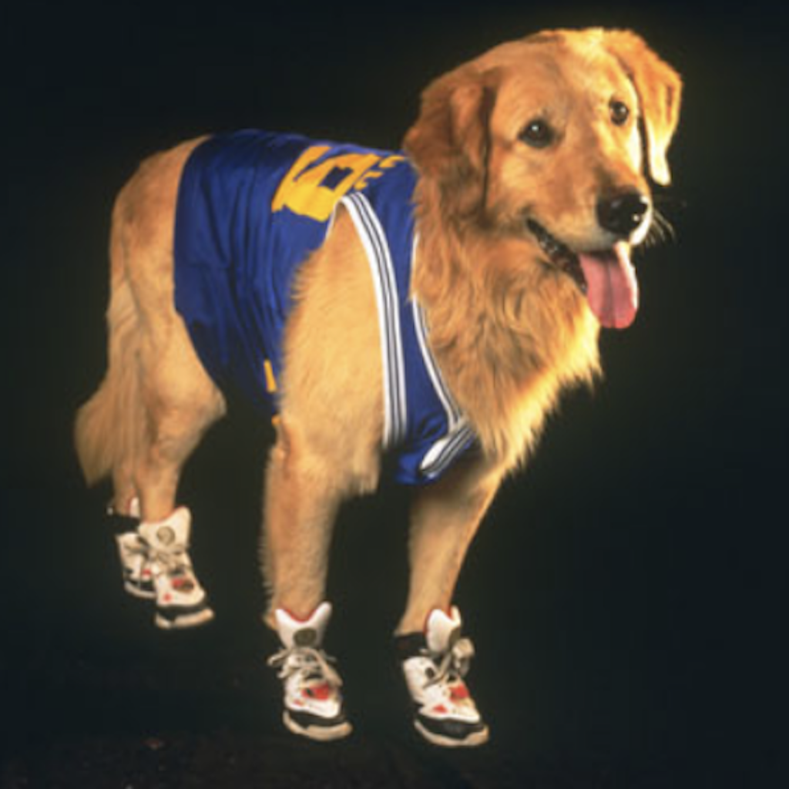
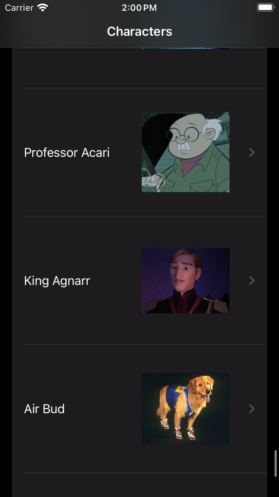
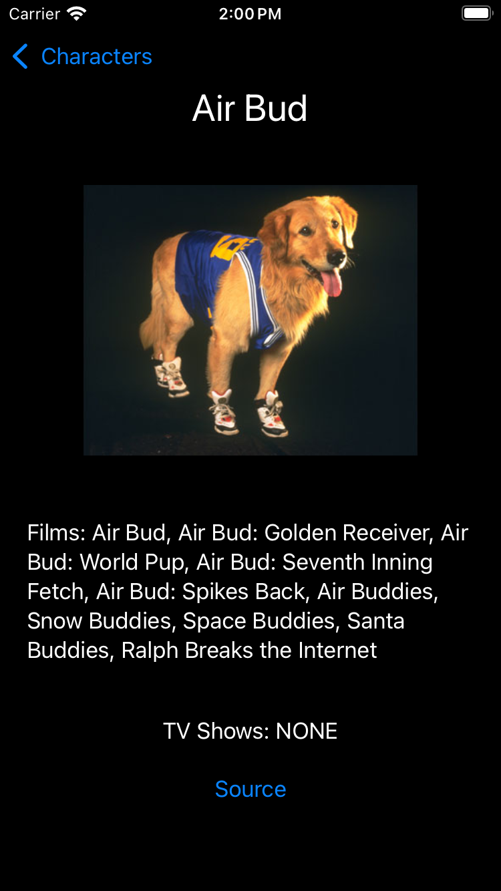

Neydis
========

 

## Introduction

More than just an app, Neydis is a _reference_ for live coding challenges involving SwiftUI.

Data are from [The Disney API](https://disneyapi.dev), which is awesome.

Because live coding challenges often don't have time for unit tests, Neydis doesn't include them. But [this app](https://github.com/algoexpert-io/iOSExpert/tree/master/solution-wrap-up/KatFancy-final) does.

## Tools & Versions Used

I developed Neydis using Xcode 16.0 and iOS 18.0.

To grok The Disney API JSON, I used [JSONFormatter](https://jsonformatter.org).

For a first draft of the model, I used [QuickType](https://quicktype.io). I like QuickType's option to be explicit about `CodingKeys` because I have found `JSONDecoder.KeyDecodingStrategy.convertFromSnakeCase` to be unreliable.

## Screenshots and GIF

| Browsing | Details | GIF    |
| -------- | ------- | ------ |
|  |  | 

## Credits

The humorous badges at the top of this readme are adapted from my [curated list](https://github.com/vermont42/Podcasts) of iOS-development podcasts.

`ImageLoader` is a modification of an approach to image loading and caching that Donny Wals presented in [this article](https://www.donnywals.com/using-swifts-async-await-to-build-an-image-loader/).

[This blog post](https://racecondition.software/blog/swiftui-homeworks/) about SwiftUI iOS-developer coding challenges introduces the more featureful predecessor of Neydis, [KatFancy](https://github.com/algoexpert-io/iOSExpert/tree/master/solution-wrap-up/KatFancy-final).

[This video](https://www.youtube.com/watch?v=n1PeOa3qXy8) by Vincent Pradeilles inspired Neydis's initial implementation.

[This post](https://tanaschita.com/20230828-pagination-in-swiftui-list/) by Natascha Fedeeva inspired Neydis's approach to displaying paginated data.

## Disclaimer

This project makes no claim to any data or images. Intellectual property involving Disney characters belongs to The Walt Disney Company.
